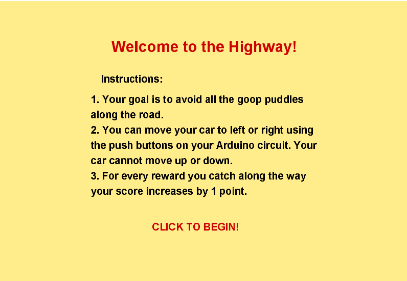
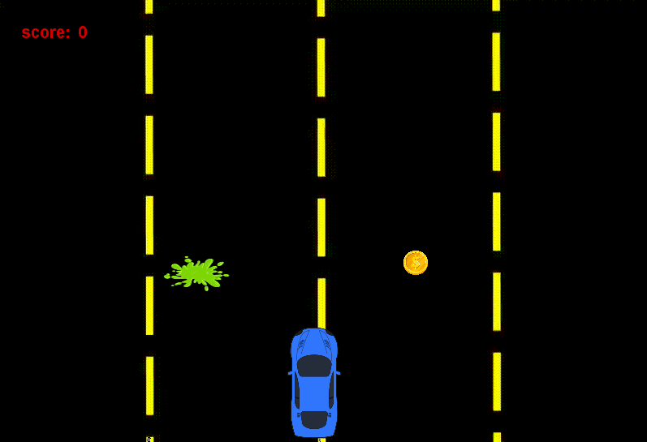

### The Highway

I've created a game where the user controls a car on a road, using two buttons on the Arduino circuit (which correspond to left and right on the screen). The user has to avoid the incoming goop puddles and collect the rewards along the way. If the car touches the goop, the user loses immediately -- and a red LED lights up on the circuit. If the user collects 10 rewards (without hitting goop), then they win the game! The score is displayed on the LCD screen always, updating live. 

Below are images of the circuit and game screens, and here is a link to a video demonstration: https://youtu.be/lp-KT-rWbOg

  

  

  

  

  

