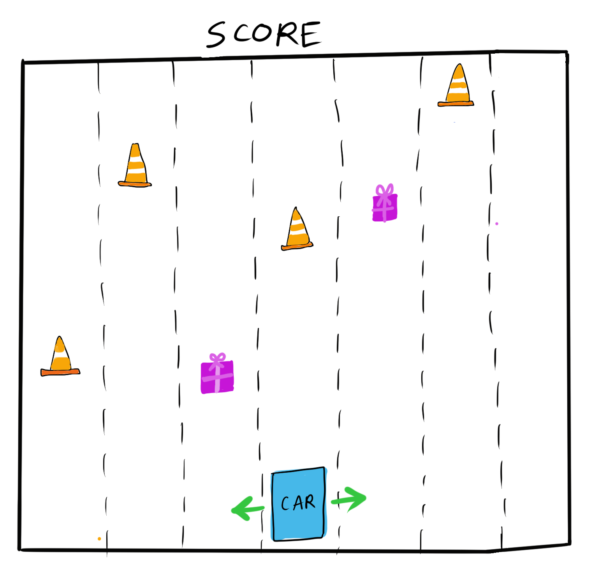
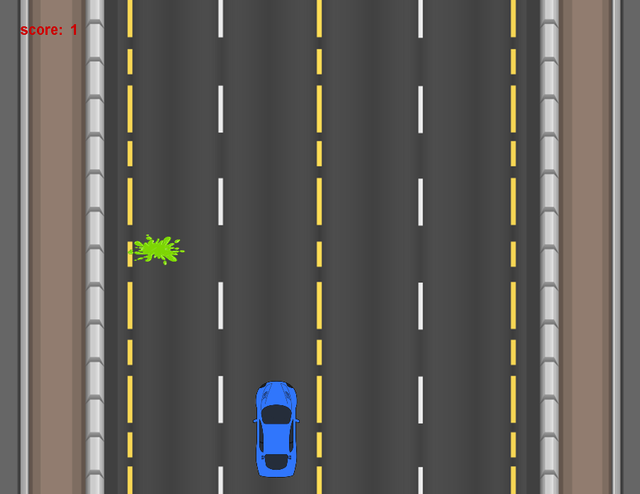

## Journal

* #### July 2 
I first sketched out a basic layout of what I envisioned the game to look like (on Processing):

<p align="center">
  
</p>

I then had to find appropriate images for the background, car, traffic cones/road blocks and rewards. It was hard to find images of the background that was simple (without excessive/distracting details) -- so I found a picture that was close enough and then I photoshopped it to the look the way I wanted. Finding top-view images of traffic cones and road blocks that matched the background aesthetic proved to be hard, so I settled for images of "goop" instead (for now) so I could get on with the code. 

The scariest thing that remains to be begun is beginning to code the game. I intend to start with Processing -- to write the entire game in Processing first, and then slowly replace parts of it with Arduino. 

As of today, the only change to the initial plan is the placeholder "goop" instead of the traffic cones. I am beginning to think that goop might indeed be a more fun option (because I can play a gross goop sound when the car drives over it). 

* #### July 3-4
I began coding the Processing part first. I have set up the basics of the beginning, game and end screens. For the game screen, I have implemented a car and incoming goop that the car has to avoid (for now the car is controlled via left and right keys on the user's keyboard). I also have a score displayed at the top left, which is just a placeholder number for now. I have not implemented the rewards yet. This is what the game screen looks like now:

<p align="center">
  
</p>

* #### July 5
I fixed some glitches with regard to the position of the goop in the Processing code. I then got started on the Arduino side of things. I set up the circuit for the LCD screen, and set up the Arduino serial to receive data from Processing. 
This proved to be especially hard -- because I had to send the score from Processing to Arduino and then display it on the LCD screen with live updates + also a signal to turn the LED on if the car hit goop. I struggled with this FOREVER, and using ```print``` showed me that nothing really was getting sent.

* #### July 6
I asked about the previously-mentioned problem in class to Professor Shiloh, who offered helpful comments that I implemented. This resulted in most of it working. I also got some help from Safal Shrestha, who pointed out to me that some of the logic in my code was flawed. Finally, I fixed it. 

I also set up push buttons in my Arduino circuit, and sent that data to Processing in order to move the car left and right. 

I was also really unhappy with the background. It was a static image, which I'd hoped would give the illusion of movement, but it didn't really work. So I found a gif of a moving road, and added it to my Processing sketch using a gifAnimation library I found online. What remains to be done is implementing rewards and fixing the score. I am considering scrapping the piezo buzzer due to time constraints. I also need to take off the score display from Processing, since it is being displayed on the LCD.

* #### July 7
I implemented rewards! I fixed the score to reflect the number of rewards collected, and added a new screen to display "Good job!" once 10 rewards had been collected. I also decided to stick with goop, instead of swapping it for traffic cones. 
